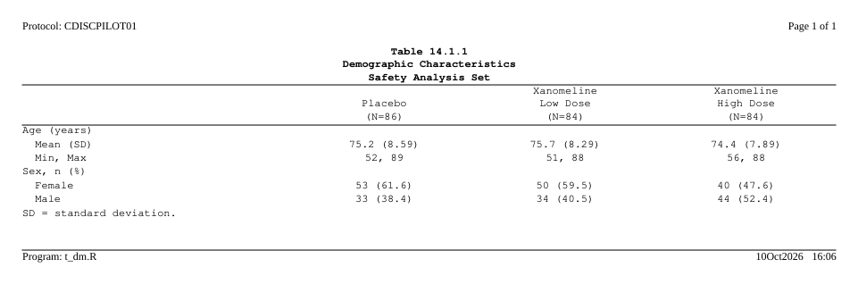

<!-- README.md is generated by hand; keep it short and link to the pkgdown site. -->

# rtfreporter 

<!-- badges: start -->
[](https://github.com/ichirio/rtfreporter/actions/workflows/R-CMD-check.yaml)
[](https://github.com/ichirio/rtfreporter/actions/workflows/test-coverage.yaml)
[](https://app.codecov.io/gh/ichirio/rtfreporter)
[](https://github.com/ichirio/rtfreporter/actions/workflows/pkgdown.yaml)
[](https://lifecycle.r-lib.org/articles/stages.html#experimental)
[](https://www.apache.org/licenses/LICENSE-2.0)
<!-- badges: end -->

`rtfreporter` is an R toolkit for generating **Rich Text Format (RTF)
Tables, Listings and Figures (TFLs)** for clinical trial deliverables —
geared to **one familiar house style** we reach for every day: the
conventional clinical layout with a borderless header table, a centred
title block, a clinical-TFL body table (column-header top + bottom rules,
no body borders), and a left-aligned footnote.  It is opinionated by
design rather than a do-everything RTF engine.  The package logo above is
literally the kind of page `generate_rtfreport()` produces.

## Why rtfreporter?

We **deliberately keep the scope small**.  rtfreporter is not a
general-purpose RTF library; it is a focused tool for the one clinical
TFL style we want to ship.  That scope cap is the point — it keeps the
package small enough to read end-to-end, thorough to test, and realistic
to maintain.  If the supported layout matches your team's house style,
you get publication-ready deliverables with almost no configuration.

## Two ways in

**1. An ARD becomes a table almost as-is.**  A correctly built analysis
results dataset (ARD) from [cards](https://pharmaverse.github.io/cards/) /
[cardx](https://insightsengineering.github.io/cardx/) goes straight to RTF:
`normalize_ard()` flattens it, `table_plan()` names the column and row
keys, and a few `plan_*()` verbs say how each cell reads.  No reshaping
by hand: the keys and statistics the ARD already has are the vocabulary.
`list_ard_keys()` shows what is inside an ARD, `pull_ard()` pulls a
statistic out (the arm counts for an `(N=86)` header), and `widen_ard()`
gives the wide data.frame if you want it.

``` r
library(cards)
ard <- ard_stack(ADSL, .by = ARM,
                 ard_summary(variables = AGE),
                 ard_tabulate(variables = SEX))

plan <- ard |>
  normalize_ard() |>
  table_plan(cols = "ARM", rows = c(group = "variable")) |>
  plan_cells(continuous  = c("Mean (SD)" = "{mean:.1f} ({sd:.2f})"),
             categorical = "{n:.0f} ({p:.1f%})", notes = FALSE)

rtf_document() |> rtf_tables(plan) |> generate_rtfreport("t_dm.rtf")
```

See [Tables from an ARD](https://ichirio.github.io/rtfreporter/articles/tables-from-ard.html).

**2. It reads the table objects you already have.**  `as_rtftables()`
takes a gt table, a gtsummary table (a `tbl_split` too), an rtables / tern
table, an rlistings listing, a flextable, a huxtable or a plain
data.frame, keeps the labels, spanners, titles and footnotes it carries,
and gives rtftable pages.

``` r
tbl <- gt::gt(head(mtcars), rownames_to_stub = TRUE)
rtf_document() |> rtf_tables(as_rtftables(tbl)) |> generate_rtfreport("t_gt.rtf")
```

See [Importing tables](https://ichirio.github.io/rtfreporter/articles/importing-tables.html)
and [gt integration](https://ichirio.github.io/rtfreporter/articles/gt-integration.html).

## Installation

The package is not on CRAN yet. Install from GitHub:

``` r
# install.packages("remotes")

# Latest release (v0.8.2)
remotes::install_github("ichirio/rtfreporter@v0.8.2")

# Development version (latest main)
remotes::install_github("ichirio/rtfreporter")
```

## A 30-second example

``` r
library(rtfreporter)
library(magrittr)

df <- data.frame(
  USUBJID = c("001-001", "001-002", "001-003"),
  TRT     = c("Placebo", "Active",  "Active"),
  AVAL    = c(12.3, 14.1, 11.7)
)

doc <- rtf_document() %>%
  rtf_section(
    page    = 1,
    secinfo = list(
      header = rtf_header(rows = list(
        c(l = "Protocol XYZ-001", r = "Confidential"),
        c(l = "Table 14.1.1",     r = "Page {AUTO_PAGE} of {AUTO_TOTAL_PAGES}")
      )),
      footer = rtf_footer(c(c = "ACME Pharma, Inc."))
    )
  ) %>%
  rtf_tables(
    # as_rtftables() turns the data into rtftable page objects -- the kind of
    # object rtf_tables() is designed to consume (a bare data.frame also works,
    # as a convenience). It is also the same entry point for gt / gtsummary /
    # rtables tables.
    as_rtftables(df, border = "tfl", row_height_twips = 280L),
    titles    = list(c("Subject Summary", "Safety Population")),
    footnotes = list(c("Source: ADaM ADSL"))
  )

generate_rtfreport(doc, "T_14_1_1.rtf", overwrite = TRUE)
```

<p align="center">
  
</p>

<p align="center"><sub><em>The generated <code>T_14_1_1.rtf</code>, opened in a word processor.</em></sub></p>

## Writing rtfreporter code with an AI assistant

rtfreporter is too new to be in any chat model's training data: asked for
rtfreporter code it reaches for `r2rtf`'s verbs or invents arguments, and
flags neither as a guess.  Give it the facts first.

The manuals **ship with the package**, so the one you attach describes the
version you actually have:

``` r
rtfreporter_ai_manual()                     # path to the user manual
rtfreporter_ai_manual(file = "manual.md")   # copy it out, ready to attach
```

Or download it -- **[AI user manual (v0.8.2)](https://ichirio.github.io/rtfreporter/ai/rtfreporter-ai-user-manual-0.8.2.md)** -- one self-contained file sized for a single chat session.  Attach it at the **start** of the session and say *"use this manual"*.  [`ai/rtfreporter-ai-user-manual.md`](https://ichirio.github.io/rtfreporter/ai/rtfreporter-ai-user-manual.md) always resolves to the newest release, so it is safe to bookmark; the development copy is published beside it under its own version.

It holds the whole workflow, the program structure a report program should
have, every `as_rtftables()` argument, the four clinical table shapes, headers
and page tokens, listings, figures, borders, and the complete list of exported
functions.  Every example in it is executed against the package and its
function list is checked against `NAMESPACE`, both by CI -- so a manual that
drifts from the API fails the build rather than misleading you.

Working *on* rtfreporter rather than with it?  See [Developing with an AI assistant](https://ichirio.github.io/rtfreporter/articles/ai-development.html), which covers the companion **developer** manual (`rtfreporter_ai_manual("dev")`).

## A focused tool, on purpose

What the small scope buys you:

- **One output style, opinionated defaults.**  No theme zoo, no
  "render anything" pipeline.  The defaults match the conventional
  clinical TFL look out of the box; you do not have to assemble it.
- **Only the features TFL → RTF needs.**  Multi-section headers /
  footers, spanning column headers, automatic page-number fields
  (`{AUTO_PAGE}` / `{AUTO_TOTAL_PAGES}`), embedded figures, and
  per-document concatenation via `assemble_rtf()`.  If a feature
  would not appear on a real clinical TFL, we resist adding it.
- **Maintainability over breadth.**  Saying *no* to scope creep is
  what keeps the package small, the tests fast, and the API stable.
- **Composable pipe API.**  `rtf_document() |> rtf_section() |>
  rtf_tables() |> generate_rtfreport()` — the same vocabulary every
  time, so building a 50-TFL deliverable is a loop.

If your deliverables need a substantially different layout, another tool
may serve you better — and that trade-off is intentional.  We would
rather do one well-defined style really well than do everything passably.
You are warmly welcome to use rtfreporter for the styles it supports.

## Bring your own table tool

The clinical-table ecosystem has several excellent builders —
[tfrmt](https://gsk-biostatistics.github.io/tfrmt/),
[gtsummary](https://www.danieldsjoberg.com/gtsummary/),
[rtables](https://CRAN.R-project.org/package=rtables) /
[tern](https://CRAN.R-project.org/package=tern),
[gt](https://gt.rstudio.com),
[flextable](https://davidgohel.github.io/flextable/) and
[huxtable](https://hughjonesd.github.io/huxtable/) — and, honestly, no
single de-facto standard has emerged yet.  rtfreporter does not ask you to pick one, to
switch, or to re-state your table in yet another vocabulary.  Whatever
your team already uses to compute and format the numbers,
[`as_rtftables()`](https://ichirio.github.io/rtfreporter/reference/as_rtftables.html)
reads that object — its column labels, alignment, spanning headers,
titles, footnotes and per-cell styling — and carries the metadata through
to RTF.

And even if you use a tool we do **not** read directly, you are still
covered: convert its result to a plain `data.frame` / tibble and
rtfreporter lays it out just the same.  A bare data.frame carries no
display metadata, so you simply re-specify what you want — column headers,
alignment, and so on — on `rtf_tables()` / `rtftable()` yourself.

The other way in, from a cards / cardx ARD through a plan, is
[Two ways in](#two-ways-in) above and
[Tables from an ARD](https://ichirio.github.io/rtfreporter/articles/tables-from-ard.html).

For worked, tool-by-tool comparisons see the *same report, every framework*
articles — [Demographics](https://ichirio.github.io/rtfreporter/articles/showcase-dm.html)
and [Adverse events](https://ichirio.github.io/rtfreporter/articles/showcase-ae.html) —
plus [Pharmaverse example tables to RTF](https://ichirio.github.io/rtfreporter/articles/tlg-catalog.html).

## Why RTF?

RTF is an old format, and we are perfectly aware of that.  Producing
`.docx` directly, or rendering straight to PDF, is entirely possible and
in some respects more modern.  We chose RTF on purpose, for the most
old-fashioned of reasons: **it is the simplest thing that fully meets the
need.**

For clinical deliverables the workflow we care about is
**RTF → (optional post-processing) → PDF**, and that route is still
genuinely useful today:

- **Simple grammar.**  RTF is plain text with a small, well-understood
  command vocabulary.  That keeps the renderer small and auditable —
  which matters in a regulated setting.
- **Easy to patch when you must.**  Because the output is just text, a
  last-minute correction can be made by hand or by a small script,
  without round-tripping through a binary editor.
- **Universally openable.**  Every word processor opens RTF and exports
  it to PDF, so the final step fits whatever your organisation already
  uses.

A PDF-first or DOCX-first toolkit could do the same job, perhaps more
elegantly or with more features.  But for *our* needs — which are modest,
specific, and well-defined — RTF remains the easiest path that is
**necessary and sufficient**.  Simplicity, here, is the feature.

## Documentation

The full pkgdown site is at <https://ichirio.github.io/rtfreporter/>:

- **Get started** — `vignette("rtfreporter-quickstart")`
- **Pipe API** — `vignette("rtfreporter-pipes")`
- **Tables from an ARD** — [cards / cardx to RTF with a plan](https://ichirio.github.io/rtfreporter/articles/tables-from-ard.html),
  [the plan verbs](https://ichirio.github.io/rtfreporter/articles/plan-verbs.html),
  [listings with a plan](https://ichirio.github.io/rtfreporter/articles/plan-listings.html) and
  [from `as_rtftables()` to a plan](https://ichirio.github.io/rtfreporter/articles/plan-and-as-rtftables.html)
- **Importing tables** — bringing gt / gtsummary / rtables / flextable /
  huxtable objects in with
  [`as_rtftables()`](https://ichirio.github.io/rtfreporter/articles/importing-tables.html)
- **Pagination** — [splitting long tables across pages](https://ichirio.github.io/rtfreporter/articles/pagination.html)
- **Listings** — [source data to the written RTF](https://ichirio.github.io/rtfreporter/articles/listings.html),
  including the column-width estimator and the wrapping rule
- **Figures** — [a plot object to a page](https://ichirio.github.io/rtfreporter/articles/figures.html)
- **Headers & footers** — [section-based running headers](https://ichirio.github.io/rtfreporter/articles/headers-footers.html)
- **Borders and rules** — [the clinical TFL frame](https://ichirio.github.io/rtfreporter/articles/borders.html)
- **Worked clinical examples** — [Demographics](https://ichirio.github.io/rtfreporter/articles/showcase-dm.html)
  and [Adverse events](https://ichirio.github.io/rtfreporter/articles/showcase-ae.html)
- **External API spec** — [the public API surface](https://ichirio.github.io/rtfreporter/articles/external-api.html)

## Status

`rtfreporter` is in active **pre-1.0 development** and carries the
`lifecycle: experimental` badge; the API may still change in
backward-incompatible ways before v1.0.0.

- **Latest release: `v0.8.2`** (2026-09-30) -- installable from GitHub
  (`remotes::install_github("ichirio/rtfreporter@v0.8.2")`); not yet on CRAN.
  **Tables from a cards / cardx ARD**: `normalize_ard()` / `widen_ard()`
  and the plan engine (`table_plan()` and the `plan_*()` verbs), adopted in
  the pre-CRAN API review; plus two fixes.  See [`NEWS.md`](NEWS.md) for
  the full release history.
- **Development version on `main`: `0.8.2.9000`.**  rtfreporter follows the
  standard R versioning scheme -- a release is `X.Y.Z`, development is
  `X.Y.Z.9000`, and the three-component part always names the last release.
  An ordinary pull request leaves `DESCRIPTION` alone unless the change is
  one somebody needs to name; changing `X`, `Y` or `Z` is a deliberate,
  labelled release action, enforced by the `version-guard` CI.

See [`NEWS.md`](NEWS.md) for the user-facing changelog and
[`CHANGELOG.md`](CHANGELOG.md) for detailed per-version notes.

## Citation

If rtfreporter helps your work, please cite it:

```r
citation("rtfreporter")
```

If the numbers in your tables come from a [cards](https://pharmaverse.github.io/cards/) /
[cardx](https://insightsengineering.github.io/cardx/) ARD, please cite those
packages too (`citation("cards")`, `citation("cardx")`): they compute the
statistics; rtfreporter only lays them out.

## Acknowledgements

rtfreporter stands on the work of many others, and we are grateful to their
authors.

- **[cards](https://pharmaverse.github.io/cards/) and
  [cardx](https://insightsengineering.github.io/cardx/)** — the analysis
  results data (ARD) that `normalize_ard()` and the `plan_*()` verbs read are
  their design, an outcome of the [pharmaverse](https://pharmaverse.org/)
  community's work on analysis results data.
- **The table builders `as_rtftables()` reads** —
  [gt](https://gt.rstudio.com), [gtsummary](https://www.danieldsjoberg.com/gtsummary/),
  [tfrmt](https://gsk-biostatistics.github.io/tfrmt/),
  [rtables](https://CRAN.R-project.org/package=rtables) /
  [rlistings](https://CRAN.R-project.org/package=rlistings) /
  [tern](https://CRAN.R-project.org/package=tern),
  [flextable](https://davidgohel.github.io/flextable/) and
  [huxtable](https://hughjonesd.github.io/huxtable/).  rtfreporter reads the
  objects they build; the tables themselves are their work.
- **[pharmaverseadam](https://pharmaverse.github.io/pharmaverseadam/)** and the
  [pharmaverse examples](https://pharmaverse.github.io/examples/) — the ADaM
  data (from the CDISC pilot study) and the example tables behind many of our
  examples and articles.

rtfreporter is an independent project and is not affiliated with, or endorsed
by, the authors of these packages.

## Contributing & bug reports

Issues and pull requests are very welcome at
<https://github.com/ichirio/rtfreporter>. Please read
[`CONTRIBUTING.md`](CONTRIBUTING.md) and the
[code of conduct](CODE_OF_CONDUCT.md) first.

## License

Apache License 2.0 © 2026 Yoichi Masui. See [`LICENSE.md`](LICENSE.md).
