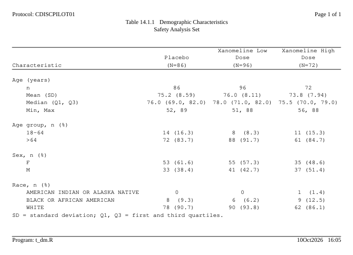
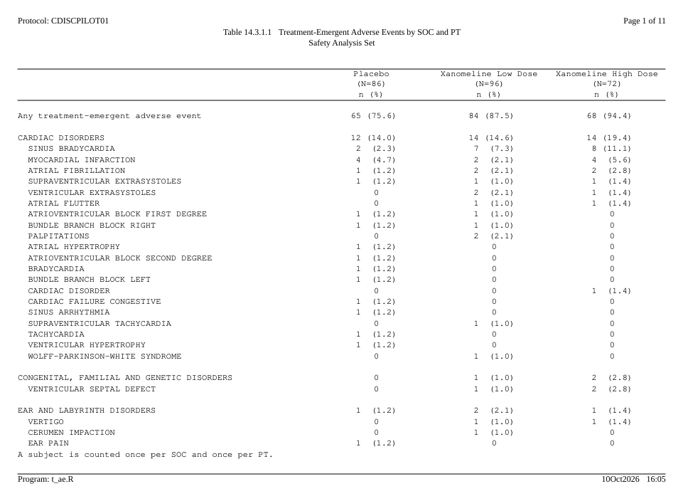
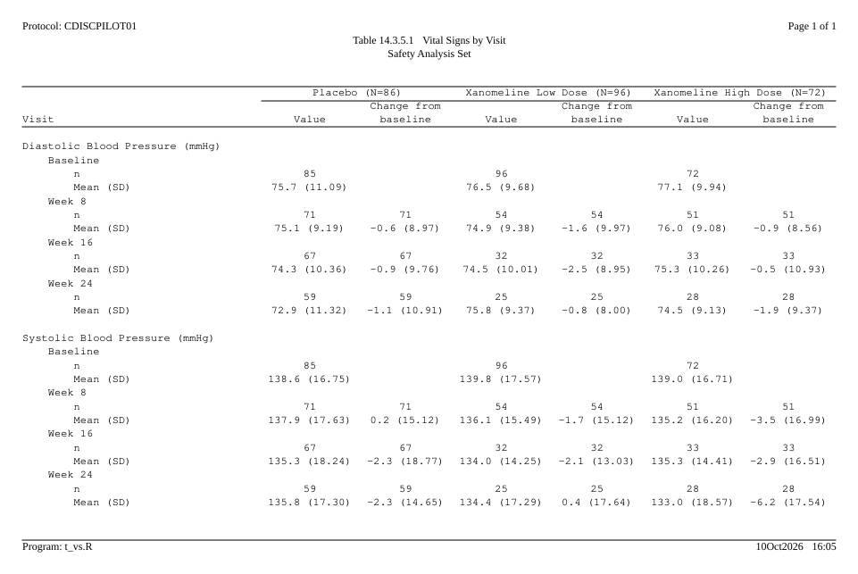
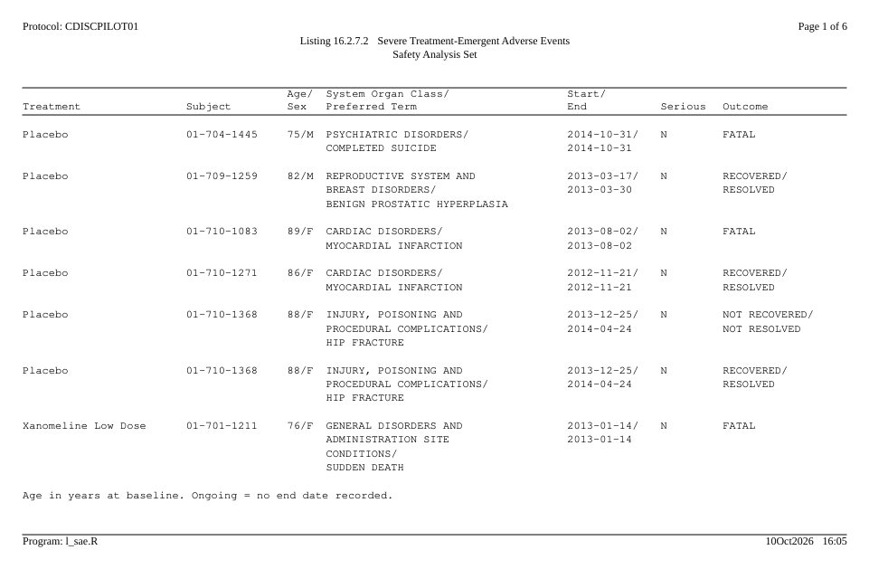
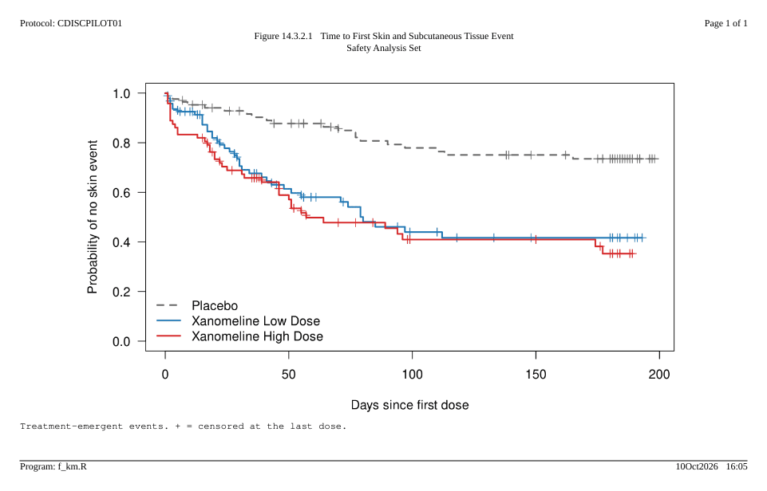
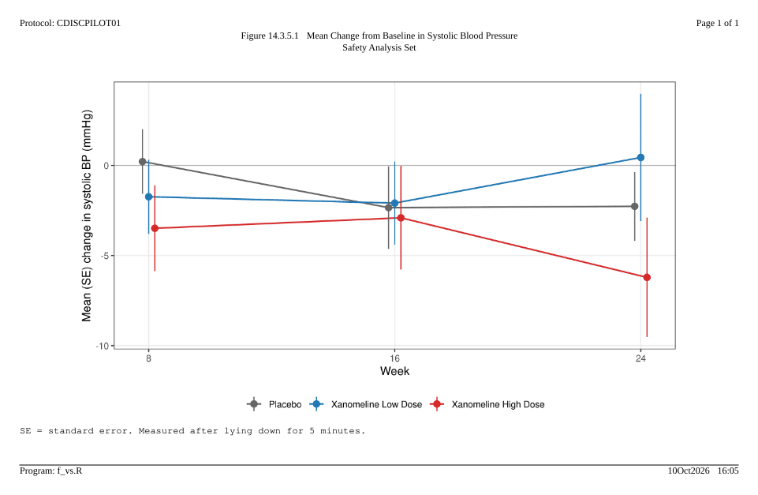

# Gallery

Each output on this page was written by the code shown above it. The
data is the CDISC pilot study as shipped in
[pharmaverseadam](https://pharmaverse.github.io/pharmaverseadam/); the
statistics come from [cards](https://pharmaverse.github.io/cards/). The
pictures are the first page of each RTF file, opened in LibreOffice,
with the empty part of the page cut out.

All the outputs share one running header and footer, so it is written
once:

``` r

library(rtfreporter)
library(cards)

arms <- c("Placebo", "Xanomeline Low Dose", "Xanomeline High Dose")
adsl <- pharmaverseadam::adsl
adsl <- adsl[adsl$SAFFL == "Y", ]
adsl$TRT01A <- factor(adsl$TRT01A, levels = arms)

# One house style for every output: protocol and page number at the top,
# program and run date at the bottom.
house_doc <- function(..., orientation = "landscape") {
  rtf_document(page = rtf_page(orientation = orientation),
               tokens = list(STUDY = "CDISCPILOT01")) |>
    rtf_section(secinfo = list(
      header = rtf_header(list(
        c(l = "Protocol: {STUDY}", r = "Page {PAGE} of {TOTAL_PAGES}"),
        ...)),
      footer = rtf_footer(c(l = "Program: {PROGRAM}", r = "{DATETIME}"))))
}
```

## Demographic characteristics

A table from an ARD: the plan says how the statistics are laid out, and
the column header’s `(N=xx)` is read from the same ARD.

``` r

ard_dm <- ard_stack(
  adsl, .by = TRT01A,
  ard_summary(variables = AGE,
              statistic = ~ continuous_summary_fns(
                c("N", "mean", "sd", "median", "p25", "p75", "min", "max"))),
  ard_tabulate(variables = c(AGEGR1, SEX, RACE)))

p_dm <- ard_dm |>
  normalize_ard() |>
  table_plan(cols = "TRT01A", rows = c(group = "variable")) |>
  plan_cells(
    continuous  = c("n"               = "{N:.0f}",
                    "Mean (SD)"       = "{mean:.1f} ({sd:.2f})",
                    "Median (Q1, Q3)" = "{median:.1f} ({p25:.1f}, {p75:.1f})",
                    "Min, Max"        = "{min:.0f}, {max:.0f}"),
    categorical = c(n == 0 ~ "0", "{n:.0f} ({p:.1f%})"),
    notes = FALSE) |>
  plan_labels(c(AGE = "Age (years)", AGEGR1 = "Age group, n (%)",
                SEX = "Sex, n (%)",  RACE   = "Race, n (%)")) |>
  plan_levels(AGEGR1 = c("18-64", ">64"), SEX = c("F", "M")) |>
  plan_stub(name = "row_label") |>
  plan_blanks(where = "between_groups", first = TRUE) |>
  plan_columns(widths = c(4, 2, 2, 2)) |>
  plan_style(border = "tfl", align_count_pct = TRUE) |>
  plan_col_header(values = list(n = TRUE), rtf_col_header(
    c("",               "{col}"),
    c("Characteristic", "(N={n})")))

doc <- house_doc(c(c = "Table 14.1.1  Demographic Characteristics"),
                 c(c = "Safety Analysis Set"),
                 orientation = "portrait") |>
  rtf_tables(p_dm, footnotes = list(
    "SD = standard deviation; Q1, Q3 = first and third quartiles."))
generate_rtfreport(doc, "t_dm.rtf", program = "t_dm.R", overwrite = TRUE)
```



## Adverse events by system organ class and preferred term

A hierarchical ARD, sorted by frequency within each SOC, with page
breaks between SOCs rather than inside one.

``` r

adae <- pharmaverseadam::adae
adae <- adae[adae$TRTEMFL %in% "Y" & adae$SAFFL %in% "Y", ]
adae$TRT01A <- factor(adae$TRT01A, levels = arms)

ard_ae <- ard_stack_hierarchical(
  adae, variables = c(AEBODSYS, AEDECOD), by = TRT01A,
  denominator = adsl, id = USUBJID, over_variables = TRUE)

p_ae <- ard_ae |>
  normalize_ard(hierarchy = c("AEBODSYS", "AEDECOD"),
                overall = "Any treatment-emergent adverse event") |>
  table_plan(cols = "TRT01A", rows = c(SOC = "AEBODSYS", PT = "AEDECOD"),
             label = NA) |>
  plan_sort(".overall", "SOC", ".depth", "-n", "PT") |>
  plan_cells("{n:.0f} ({p:.1f%})", notes = FALSE) |>
  plan_stub(name = "System Organ Class\n  Preferred Term", indent = 2) |>
  plan_blanks(where = "between_groups", first = TRUE) |>
  plan_paginate_rows(max_rows = 30, split = "group_safe") |>
  plan_columns(widths = c(5, 2, 2, 2)) |>
  plan_style(border = "tfl", align_count_pct = TRUE) |>
  plan_col_header(values = list(n = TRUE), rtf_col_header(
    c("", "{col}"),
    c("", "(N={n})\nn (%)")))

doc <- house_doc(
  c(c = "Table 14.3.1.1  Treatment-Emergent Adverse Events by SOC and PT"),
  c(c = "Safety Analysis Set")) |>
  rtf_tables(p_ae, footnotes = list(
    "A subject is counted once per SOC and once per PT."))
generate_rtfreport(doc, "t_ae.rtf", program = "t_ae.R", overwrite = TRUE)
length(plan_apply(p_ae))    # pages
#> [1] 11
```



## Vital signs by visit

Two statistics side by side under each arm – the value and the change
from baseline – under a spanning header per arm, and a nested stub of
parameter, visit and statistic.

``` r

visits <- c("Baseline", "Week 8", "Week 16", "Week 24")
advs <- pharmaverseadam::advs
advs <- advs[advs$PARAMCD %in% c("SYSBP", "DIABP") &
               advs$ATPT %in% "AFTER LYING DOWN FOR 5 MINUTES" &
               (advs$ABLFL %in% "Y" | advs$ANL01FL %in% "Y") &
               advs$AVISIT %in% visits & advs$USUBJID %in% adsl$USUBJID, ]
advs$TRTA   <- factor(advs$TRT01A, levels = arms)
advs$AVISIT <- factor(advs$AVISIT, levels = visits)

stats <- ~ continuous_summary_fns(c("N", "mean", "sd"))
ard_vs <- bind_ard(
  ard_summary(advs, by = c(PARAM, AVISIT, TRTA), variables = AVAL,
              statistic = stats),
  ard_summary(droplevels(advs[advs$AVISIT != "Baseline", ]),
              by = c(PARAM, AVISIT, TRTA), variables = CHG,
              statistic = stats))

p_vs <- ard_vs |>
  normalize_ard() |>
  table_plan(cols = c("TRTA", "variable"),
             rows = c(PARAM = "PARAM", Visit = "AVISIT")) |>
  plan_levels(variable = c("AVAL", "CHG")) |>
  plan_cells(continuous = c("n"         = "{N:.0f}",
                            "Mean (SD)" = "{mean:.1f} ({sd:.2f})"),
             na = "", notes = FALSE) |>
  plan_stub(name = "Visit") |>
  plan_blanks(where = "between_groups", first = TRUE, last = TRUE) |>
  plan_columns(widths = c(5, rep(2, 6))) |>
  plan_style(border = "tfl") |>
  plan_col_header(values = list(n = c(table(adsl$TRT01A))), rtf_col_header(
    c(list(col_cell(1, "")),
      lapply(1:3, function(i) col_cell(c(2 * i, 2 * i + 1), "{col1} (N={n})"))),
    c("Visit", rep(c("Value", "Change from\nbaseline"), 3))))

doc <- house_doc(c(c = "Table 14.3.5.1  Vital Signs by Visit"),
                 c(c = "Safety Analysis Set")) |>
  rtf_tables(p_vs)
generate_rtfreport(doc, "t_vs.rtf", program = "t_vs.R", overwrite = TRUE)
```



## Listing of severe adverse events

A listing prints records, not statistics. Cells wrap to their column
width, key columns print on a record’s first line only, and a record is
never split across pages.

``` r

sae <- adae[adae$AESEV %in% "SEVERE", ]
sae <- merge(sae, adsl[, c("USUBJID", "AGE", "SEX")], by = "USUBJID",
             suffixes = c("", ".adsl"))
sae <- sae[order(sae$TRT01A, sae$USUBJID, sae$ASTDT), ]
sae$ASTDT <- format(sae$ASTDT, "%Y-%m-%d")
sae$AENDT <- ifelse(is.na(sae$AENDT), "Ongoing", format(sae$AENDT, "%Y-%m-%d"))

p_sae <- table_plan(sae) |>
  plan_listing(
    listing_col("TRT01A", width = 20, label = "Treatment", collapse_repeats = TRUE),
    listing_col("USUBJID", width = 12, label = "Subject", collapse_repeats = TRUE),
    listing_col(c("AGE", "SEX"), label = "Age/\nSex", layout = "flow"),
    listing_col(c("AEBODSYS", "AEDECOD"), width = 30,
                label = "System Organ Class/\nPreferred Term"),
    listing_col(c("ASTDT", "AENDT"), width = 11, label = "Start/\nEnd"),
    listing_col("AESER", label = "Serious"),
    listing_col("AEOUT", width = 16, label = "Outcome")) |>
  plan_blanks(where = "records") |>
  plan_paginate_rows(max_rows = 30) |>
  plan_style(border = "tfl")

doc <- house_doc(c(c = "Listing 16.2.7.2  Severe Treatment-Emergent Adverse Events"),
                 c(c = "Safety Analysis Set")) |>
  rtf_tables(p_sae, footnotes = list(
    "Age in years at baseline. Ongoing = no end date recorded."))
generate_rtfreport(doc, "l_sae.rtf", program = "l_sae.R", overwrite = TRUE)
```



## Kaplan-Meier plot

A figure is a page like any other: the same running header and footer,
its own titles and footnotes. Here the plot is drawn with base R and the
survival package; anything that draws – ggplot2, lattice, grid – goes in
the same way.

``` r

# Time to the first treatment-emergent skin event, censored at the last dose
skin <- adae[adae$AEBODSYS %in% "SKIN AND SUBCUTANEOUS TISSUE DISORDERS", ]
first <- tapply(skin$ASTDT, skin$USUBJID, min)
tte <- adsl[!is.na(adsl$TRTEDT), c("USUBJID", "TRT01A", "TRTSDT", "TRTEDT")]
tte$event <- as.integer(tte$USUBJID %in% names(first))
tte$end   <- tte$TRTEDT
tte$end[tte$event == 1] <- as.Date(first[tte$USUBJID[tte$event == 1]])
tte$days  <- as.numeric(tte$end - tte$TRTSDT) + 1
fit <- survival::survfit(survival::Surv(days, event) ~ TRT01A, data = tte)

km <- function() {
  op <- par(mar = c(4.5, 4.5, 1, 1))
  on.exit(par(op))
  plot(fit, col = c("grey40", "#1f77b4", "#d62728"), lty = c(2, 1, 1),
       lwd = 2, mark.time = TRUE, xlab = "Days since first dose",
       ylab = "Probability of no skin event", las = 1)
  legend("bottomleft", legend = arms, col = c("grey40", "#1f77b4", "#d62728"),
         lty = c(2, 1, 1), lwd = 2, bty = "n")
}

doc <- house_doc(c(c = "Figure 14.3.2.1  Time to First Skin and Subcutaneous Tissue Event"),
                 c(c = "Safety Analysis Set")) |>
  rtf_figures(rtfplot(km, render_width = 8, render_height = 4.6,
                      render_dpi = 150),
              footnotes = list(
                "Treatment-emergent events. + = censored at the last dose."))
generate_rtfreport(doc, "f_km.rtf", program = "f_km.R", overwrite = TRUE)
```



## Mean change from baseline over time

``` r

library(ggplot2)

sbp <- advs[advs$PARAMCD == "SYSBP" & advs$AVISIT != "Baseline", ]
mc  <- aggregate(CHG ~ TRTA + AVISIT, data = sbp,
                 FUN = function(x) c(m = mean(x), se = sd(x) / sqrt(length(x))))
mc  <- do.call(data.frame, mc)
mc$week <- as.numeric(sub("Week ", "", mc$AVISIT))

g <- ggplot(mc, aes(week, CHG.m, colour = TRTA)) +
  geom_hline(yintercept = 0, colour = "grey70") +
  geom_line(linewidth = 0.7, position = position_dodge(0.6)) +
  geom_pointrange(aes(ymin = CHG.m - CHG.se, ymax = CHG.m + CHG.se),
                  position = position_dodge(0.6)) +
  scale_colour_manual(values = c("grey40", "#1f77b4", "#d62728")) +
  scale_x_continuous(breaks = c(8, 16, 24)) +
  labs(x = "Week", y = "Mean (SE) change in systolic BP (mmHg)", colour = NULL) +
  theme_bw(base_size = 11) +
  theme(legend.position = "bottom", panel.grid.minor = element_blank())

doc <- house_doc(
  c(c = "Figure 14.3.5.1  Mean Change from Baseline in Systolic Blood Pressure"),
  c(c = "Safety Analysis Set")) |>
  rtf_figures(rtfplot(g, render_width = 8, render_height = 4.6,
                      render_dpi = 150),
              footnotes = list("SE = standard error. Measured after lying down for 5 minutes."))
generate_rtfreport(doc, "f_vs.rtf", program = "f_vs.R", overwrite = TRUE)
```



## Where next

- [Get
  started](https://ichirio.github.io/rtfreporter/articles/rtfreporter.md)
  walks through the first table above step by step.
- [The plan
  verbs](https://ichirio.github.io/rtfreporter/articles/plan-verbs.md),
  [Listings with a
  plan](https://ichirio.github.io/rtfreporter/articles/plan-listings.md)
  and
  [Figures](https://ichirio.github.io/rtfreporter/articles/figures.md)
  explain the pieces used here.
- [Rendering, post-processing and
  assembly](https://ichirio.github.io/rtfreporter/articles/output.md)
  joins finished files like these into one deliverable with a table of
  contents.
