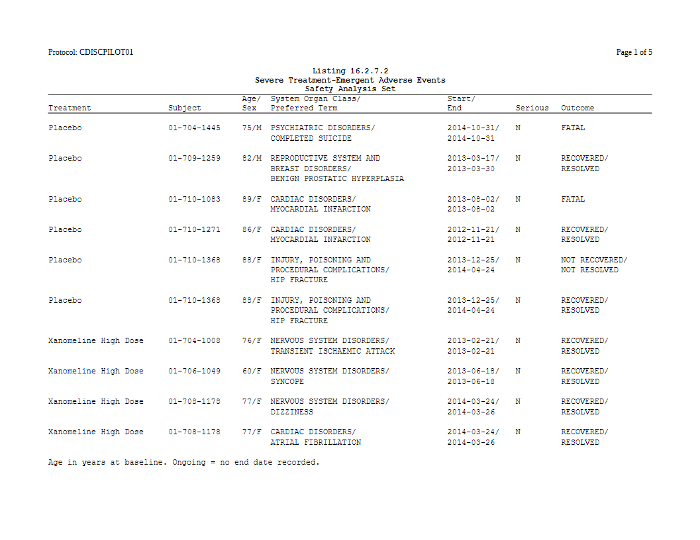

# Listings with a plan

A listing is not built from an ARD. It prints records, one row of source
data per subject or per event, so there are no statistics to fill in. A
plan still helps. It uses the same verbs as a table for the pages, the
blank rows, the style and the titles, so a report program that has
tables and listings writes both the same way.

The listing machinery itself
([`listing_col()`](https://ichirio.github.io/rtfreporter/reference/listing_col.md),
[`listing_spec()`](https://ichirio.github.io/rtfreporter/reference/listing_spec.md),
wrapping, widths) is described in [Listings end to
end](https://ichirio.github.io/rtfreporter/articles/listings.md). This
article shows how it fits into a plan.

``` r

library(rtfreporter)
```

## The records

Severe treatment-emergent adverse events from the CDISC pilot study, one
row per event:

``` r

adsl <- pharmaverseadam::adsl
adae <- pharmaverseadam::adae
sae <- adae[adae$AESEV %in% "SEVERE" & adae$TRTEMFL %in% "Y" &
               adae$SAFFL %in% "Y", ]
sae <- merge(sae, adsl[, c("USUBJID", "AGE", "SEX")], by = "USUBJID",
             suffixes = c("", ".adsl"))
sae <- sae[order(sae$TRT01A, sae$USUBJID, sae$ASTDT), ]
sae$ASTDT <- format(sae$ASTDT, "%Y-%m-%d")
sae$AENDT <- ifelse(is.na(sae$AENDT), "Ongoing", format(sae$AENDT, "%Y-%m-%d"))
nrow(sae)
#> [1] 41
```

## The plan

[`table_plan()`](https://ichirio.github.io/rtfreporter/reference/table_plan.md)
is handed the records as they are.
[`plan_listing()`](https://ichirio.github.io/rtfreporter/reference/plan_verbs.md)
says it is a listing: its arguments are the printed columns, each a
[`listing_col()`](https://ichirio.github.io/rtfreporter/reference/listing_col.md),
plus
[`listing_spec()`](https://ichirio.github.io/rtfreporter/reference/listing_spec.md)’s
own settings. A column can combine several source variables, joined by
`/` and wrapped to its width:

``` r

p_body <- table_plan(sae) |>
  plan_listing(
    listing_col("TRT01A", width = 20, label = "Treatment", collapse_repeats = TRUE),
    listing_col("USUBJID", width = 12, label = "Subject", collapse_repeats = TRUE),
    listing_col(c("AGE", "SEX"), label = "Age/\nSex", layout = "flow"),
    listing_col(c("AEBODSYS", "AEDECOD"), width = 30,
                label = "System Organ Class/\nPreferred Term"),
    listing_col(c("ASTDT", "AENDT"), width = 11, label = "Start/\nEnd"),
    listing_col("AESER", label = "Serious"),
    listing_col("AEOUT", width = 16, label = "Outcome")) |>
  plan_blanks(where = "records") |>
  plan_paginate_rows(max_rows = 36) |>
  plan_style(border = "tfl")

p <- p_body |>
  plan_titles("Listing 16.2.7.2", "Severe Treatment-Emergent Adverse Events",
              "Safety Analysis Set") |>
  plan_footnotes("Age in years at baseline. Ongoing = no end date recorded.")
```

- `collapse_repeats = TRUE` marks a **key** column. Its value prints on
  the first line of a record and not on the lines a wrapped cell adds
  below it. If a record continues onto the next page, the value prints
  again at the top of that page.
- `plan_blanks(where = "records")` puts a blank row between records.
  `first = TRUE` would add one at the top of every page too.
- `plan_paginate_rows(max_rows = )` counts **physical** rows, including
  the extra lines of wrapped cells, and never splits a record across
  pages.
- [`plan_titles()`](https://ichirio.github.io/rtfreporter/reference/plan_verbs.md)
  and
  [`plan_footnotes()`](https://ichirio.github.io/rtfreporter/reference/plan_verbs.md)
  put the same block on every page.

``` r

doc <- rtf_document(page = rtf_page(orientation = "landscape")) |>
  rtf_section(secinfo = list(header = rtf_header(list(
    c(l = "Protocol: CDISCPILOT01", r = "Page {PAGE} of {TOTAL_PAGES}"))))) |>
  rtf_tables(p)
generate_rtfreport(doc, "l_sae.rtf", overwrite = TRUE)
length(plan_apply(p))    # pages
#> [1] 5
```



## The same listing without a plan

The plan resolves to one
[`as_rtftables()`](https://ichirio.github.io/rtfreporter/reference/as_rtftables.md)
call. Written by hand, it is:

``` r

spec <- listing_spec(list(
  listing_col("TRT01A", width = 20, label = "Treatment", collapse_repeats = TRUE),
  listing_col("USUBJID", width = 12, label = "Subject", collapse_repeats = TRUE),
  listing_col(c("AGE", "SEX"), label = "Age/\nSex", layout = "flow"),
  listing_col(c("AEBODSYS", "AEDECOD"), width = 30,
              label = "System Organ Class/\nPreferred Term"),
  listing_col(c("ASTDT", "AENDT"), width = 11, label = "Start/\nEnd"),
  listing_col("AESER", label = "Serious"),
  listing_col("AEOUT", width = 16, label = "Outcome")),
  blank_row = TRUE)
pages <- as_rtftables(sae, listing = spec, max_rows = 36, border = "tfl")

all.equal(pages, plan_apply(p_body))
#> [1] TRUE
```

The two give the same pages. The comparison uses `p_body`, the plan
before its titles and footnotes, because the hand-written call would
pass those to
[`rtf_tables()`](https://ichirio.github.io/rtfreporter/reference/rtf_tables.md)
instead. Write it whichever way suits the program. The plan has two
advantages:

- **The same verbs as the tables.** A report’s page length, borders and
  titles are written the same way for a listing and for a table.
- **A plan can be kept as a spec.** tflspec saves a plan’s declarations
  to a workbook and builds the plan again from it, so the listing’s
  layout lives next to the tables’ in one study spec.

## Checking the widths first

The widths above were picked by hand.
[`fit_listing_widths()`](https://ichirio.github.io/rtfreporter/reference/fit_listing_widths.md)
works them out from the paper, the font and the longest values. Pass it
the records and the same columns without widths, and paste the widths it
suggests into `listing_col(width = )`. See [Listings end to
end](https://ichirio.github.io/rtfreporter/articles/listings.html#letting-the-page-choose-the-widths).
