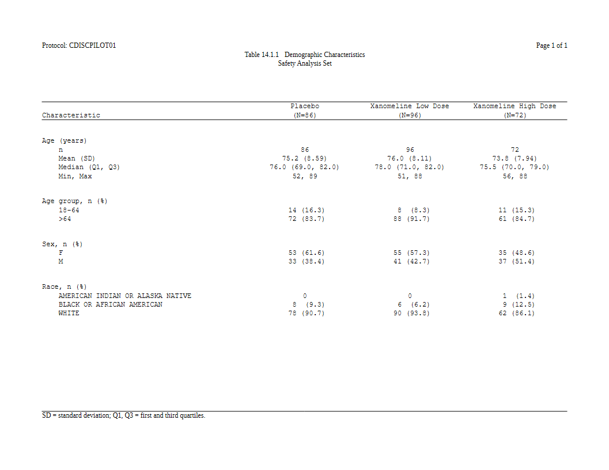
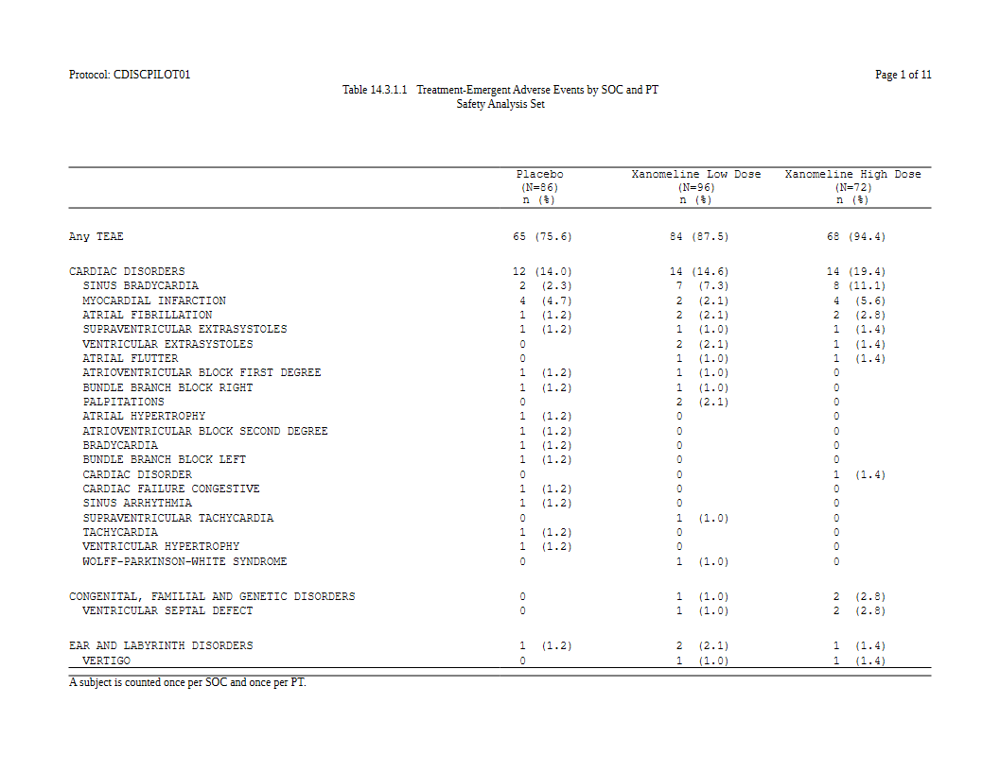

# Tables from an ARD

Most of rtfreporter starts from a table that already exists: a data
frame, a `gt`, an `rtables` object, and
[`as_rtftables()`](https://ichirio.github.io/rtfreporter/reference/as_rtftables.md)
turns it into pages. This article starts one step earlier, from an
**analysis results dataset** (ARD): the long frame of statistics that
[cards](https://insightsengineering.github.io/cards/) and
[cardx](https://insightsengineering.github.io/cardx/) produce, one
number a row.

An ARD holds the numbers but not how the table shows them. Somebody
still has to say which key goes across and which goes down, how a mean
and an SD become one cell, what the rows are called and what the header
says. In rtfreporter that is written as a **plan**:

    ARD ──normalize_ard()──▶ flat frame ──table_plan()──▶ plan ──plan_*() verbs──▶ plan
                                                                           │
                                         rtf_tables(doc, plan) ◀───────────┘

- [`normalize_ard()`](https://ichirio.github.io/rtfreporter/reference/normalize_ard.md)
  flattens the ARD: groups and hierarchy become ordinary key columns.
- [`table_plan()`](https://ichirio.github.io/rtfreporter/reference/table_plan.md)
  names the **roles**: the column that goes across, the ones that go
  down.
- each `plan_*()` verb adds one declaration: the cell templates, the
  labels, the header, the widths. Nothing runs yet.
- `rtf_tables(doc, plan)` (or `plan_apply(plan)`) runs the plan and
  gives `rtftable` pages, the same objects
  [`as_rtftables()`](https://ichirio.github.io/rtfreporter/reference/as_rtftables.md)
  makes.

``` r

library(rtfreporter)
library(cards)
```

## The data and the ARD

The examples use the CDISC pilot study as the
[pharmaverseadam](https://pharmaverse.github.io/pharmaverseadam/)
package ships it. The treatment is made a factor so the arms come out in
study order.

``` r

arms <- c("Placebo", "Xanomeline Low Dose", "Xanomeline High Dose")
adsl <- pharmaverseadam::adsl
adsl <- adsl[adsl$SAFFL == "Y", ]
adsl$TRT01A <- factor(adsl$TRT01A, levels = arms)
```

A demographics ARD: age summarised, three characteristics tabulated, all
by arm.
[`continuous_summary_fns()`](https://pharmaverse.github.io/cards/latest-tag/reference/summary_functions.html)
adds the quartiles, which cards leaves out by default.

``` r

ard_dm <- ard_stack(
  adsl, .by = TRT01A,
  ard_continuous(
    variables = AGE,
    statistic = ~ continuous_summary_fns(
      c("N", "mean", "sd", "median", "p25", "p75", "min", "max"))),
  ard_categorical(variables = c(AGEGR1, SEX, RACE)))
```

`ard_stack(.by = )` also counts the arms themselves. The plan reads
those counts for the `(N=86)` in the column header, so nobody types
them.

## Step 1: flatten it

A cards ARD keeps its groups as pairs of columns (`group1`,
`group1_level`) whose values are lists.
[`normalize_ard()`](https://ichirio.github.io/rtfreporter/reference/normalize_ard.md)
turns each group into a column of its own, named after the variable, and
adds the columns a table needs: the kind of each row (`.kind`), its
label and its depth in a hierarchy.

``` r

nd <- normalize_ard(ard_dm)
nd[1:4, c("TRT01A", "variable", "variable_level", "context",
          "stat_name", "stat", ".kind")]
#>    TRT01A variable variable_level    context stat_name      stat      .kind
#> 1 Placebo      AGE           <NA> continuous         N 86.000000 continuous
#> 2 Placebo      AGE           <NA> continuous      mean 75.209302 continuous
#> 3 Placebo      AGE           <NA> continuous        sd  8.590167 continuous
#> 4 Placebo      AGE           <NA> continuous    median 76.000000 continuous
```

This frame is what the plan works on. Its columns are the names you will
use in
[`table_plan()`](https://ichirio.github.io/rtfreporter/reference/table_plan.md):
look at them first.

## Step 2: the roles

[`table_plan()`](https://ichirio.github.io/rtfreporter/reference/table_plan.md)
takes the roles and nothing else, like `ggplot(aes())`:

- `cols`: the key that goes **across**, one column per arm;
- `rows`: the keys that go **down**, here the analysis variable, called
  `group` in the table.

``` r

p <- nd |>
  table_plan(cols = "TRT01A", rows = c(group = "variable"))
```

## Step 3: the cells

[`plan_cells()`](https://ichirio.github.io/rtfreporter/reference/plan_verbs.md)
says how the statistics become text. A cell is a template: `{mean:.1f}`
is the mean to one decimal, `{p:.1f%}` a proportion shown as a
percentage. Entries can be keyed by the kind of variable:

- `continuous`: a **named** vector, one printed row per name. The name
  is the row label.
- `categorical`: one template for every level, `n (%)`. A formula entry
  comes first and wins where it applies: `n == 0 ~ "0"` prints a zero
  count without its `(0.0)`.

``` r

p <- p |>
  plan_cells(
    continuous  = c("n"               = "{N:.0f}",
                    "Mean (SD)"       = "{mean:.1f} ({sd:.2f})",
                    "Median (Q1, Q3)" = "{median:.1f} ({p25:.1f}, {p75:.1f})",
                    "Min, Max"        = "{min:.0f}, {max:.0f}"),
    categorical = c(n == 0 ~ "0", "{n:.0f} ({p:.1f%})"),
    notes = FALSE)
```

`notes = FALSE` turns off the message listing the statistics no template
used. Leave it on while you write a plan: it is how you notice a
statistic you forgot.

## Step 4: how it looks

The rest is display. The variables get readable labels and their levels
an order, then the stub, blank rows, widths and header are declared:

``` r

p <- p |>
  plan_labels(c(AGE    = "Age (years)",
                AGEGR1 = "Age group, n (%)",
                SEX    = "Sex, n (%)",
                RACE   = "Race, n (%)")) |>
  plan_levels(AGEGR1 = c("18-64", ">64"), SEX = c("F", "M")) |>
  plan_stub(name = "row_label") |>
  plan_blanks(where = "between_groups", first = TRUE, last = TRUE) |>
  plan_columns(widths = c(4, 2, 2, 2)) |>
  plan_style(border = "tfl", align_count_pct = TRUE) |>
  plan_col_header(values = list(n = TRUE), rtf_col_header(
    c("",               "{col}"),
    c("Characteristic", "(N={n})")))
```

- [`plan_stub()`](https://ichirio.github.io/rtfreporter/reference/plan_verbs.md)
  folds the variable and its rows into one indented column, the usual
  look of a demographics table.
- [`plan_col_header()`](https://ichirio.github.io/rtfreporter/reference/plan_verbs.md)
  writes the header with the same
  [`rtf_col_header()`](https://ichirio.github.io/rtfreporter/reference/rtf_col_header.md)
  as anywhere else. Its cells can use tokens: `{col}` is the column’s
  arm and `{n}` its population. `values = list(n = TRUE)` says to read
  that population from the ARD.
- `align_count_pct = TRUE` lines up the `n` and the `(%)` of every count
  in a column.

The plan still has not run. Printing it lists what it declares, and the
values the header tokens will take:

``` r

p
#> <table_plan>  from a normalized frame, 9 layers  ->  RTF pages
#>       cols   "TRT01A"
#>       rows   group = "variable"
#>    1. cells      continuous, categorical
#>    2. cell_options notes
#>    3. labels     labels
#>    4. levels     levels
#>    5. stub       name, before
#>    6. blanks     blank_rows, blank_row_first, blank_row_end
#>    7. columns    widths
#>    8. style      border, align_count_pct
#>    9. header     header, values
#>   in                -- what cols / rows / label may name:
#>       TRT01A, variable, variable_level, context, stat_name, stat_label,
#>       stat, stat_fmt, .kind, .depth, .label, .label_order, group1,
#>       group1_level, fmt_fun, warning, error
#>   after widen       -- not computed yet; run it once and this print fills in
#>   header tokens     -- what a plan_col_header() cell may carry:
#>       {n}                       = c(Placebo = 86, Xanomeline Low Dose = 96, Xanomeline High Dose = 72)
#>       {n:sum}                   = 254 over every column (less over a spanner: its own columns)
#>       {n:Placebo}               = 86
#>       {n:Xanomeline Low Dose}   = 96
#>       {n:Xanomeline High Dose}  = 72
#>   rtf_tables(doc, x) renders it;  plan_apply(x, "args") shows the call
```

## Step 5: run it

[`rtf_tables()`](https://ichirio.github.io/rtfreporter/reference/rtf_tables.md)
takes the plan as it takes any table, and runs it:

``` r

doc <- rtf_document() |>
  rtf_section(secinfo = list(
    header = rtf_header(list(
      c(l = "Protocol: CDISCPILOT01", r = "Page {PAGE} of {TOTAL_PAGES}"),
      c(c = "Table 14.1.1  Demographic Characteristics"),
      c(c = "Safety Analysis Set"),
      c(c = ""))),
    footer = rtf_footer(list(
      c(l = "SD = standard deviation; Q1, Q3 = first and third quartiles."))))) |>
  rtf_tables(p)
generate_rtfreport(doc, "t_dm.rtf", overwrite = TRUE)
```



To see a stage without writing RTF, use
[`plan_apply()`](https://ichirio.github.io/rtfreporter/reference/plan_apply.md).
It gives the pages by default. `stage = "table"` gives the table data
frame before it is split into pages, which is often the quickest way to
check a cell:

``` r

tb <- plan_apply(p, stage = "table")
tb[1:7, ]
#>              group           label           Placebo Xanomeline Low Dose Xanomeline High Dose
#> 1      Age (years)               n                86                  96                   72
#> 2      Age (years)       Mean (SD)       75.2 (8.59)         76.0 (8.11)          73.8 (7.94)
#> 3      Age (years) Median (Q1, Q3) 76.0 (69.0, 82.0)   78.0 (71.0, 82.0)    75.5 (70.0, 79.0)
#> 4      Age (years)        Min, Max            52, 89              51, 88               56, 88
#> 5 Age group, n (%)           18-64         14 (16.3)             8 (8.3)            11 (15.3)
#> 6 Age group, n (%)             >64         72 (83.7)           88 (91.7)            61 (84.7)
#> 7       Sex, n (%)               F         53 (61.6)           55 (57.3)            35 (48.6)
```

## A layer can be overridden

A plan is a list of layers, and **a later layer wins** over what an
earlier one said about the same key. A house style can be written once
and one table adjusted by adding a line, not by editing the original:

``` r

p2 <- p |>
  plan_labels(AGE = "Age at baseline (years)") |>
  plan_cells(AGE = c("n" = "{N:.0f}", "Mean (SD)" = "{mean:.1f} ({sd:.1f})"))
plan_apply(p2, stage = "table")[1:4, ]
#>                     group     label    Placebo Xanomeline Low Dose Xanomeline High Dose
#> 1 Age at baseline (years)         n         86                  96                   72
#> 2 Age at baseline (years) Mean (SD) 75.2 (8.6)          76.0 (8.1)           73.8 (7.9)
#> 3        Age group, n (%)     18-64  14 (16.3)             8 (8.3)            11 (15.3)
#> 4        Age group, n (%)       >64  72 (83.7)           88 (91.7)            61 (84.7)
```

The `AGE` entry is narrower than `continuous`, so it applies to `AGE`
alone. The other variables keep the kind-wide template.

## Adverse events: a hierarchy, sorted by frequency

A table of adverse events by system organ class (SOC) and preferred term
(PT) starts from
[`ard_stack_hierarchical()`](https://pharmaverse.github.io/cards/latest-tag/reference/ard_stack_hierarchical.html).
`over_variables = TRUE` adds the “any event” row, and the denominator is
the safety population in ADSL, so the percentages are of the arm.

``` r

adae <- pharmaverseadam::adae
adae <- adae[adae$TRTEMFL %in% "Y" & adae$SAFFL %in% "Y", ]
adae$TRT01A <- factor(adae$TRT01A, levels = arms)

ard_ae <- ard_stack_hierarchical(
  adae, variables = c(AEBODSYS, AEDECOD), by = TRT01A,
  denominator = adsl, id = USUBJID, over_variables = TRUE)
```

[`normalize_ard()`](https://ichirio.github.io/rtfreporter/reference/normalize_ard.md)
is told which variables are the hierarchy, and what to call the overall
row:

``` r

p_ae <- ard_ae |>
  normalize_ard(hierarchy = c("AEBODSYS", "AEDECOD"),
                overall = "Any TEAE") |>
  table_plan(cols = "TRT01A", rows = c(SOC = "AEBODSYS", PT = "AEDECOD"),
             label = NA) |>
  plan_sort(".overall", "SOC", ".depth", "-n", "PT") |>
  plan_cells("{n:.0f} ({p:.1f%})", notes = FALSE) |>
  plan_stub(name = "System Organ Class\n  Preferred Term", indent = 2) |>
  plan_blanks(where = "between_groups", first = TRUE) |>
  plan_paginate_rows(max_rows = 30, split = "group_safe") |>
  plan_columns(widths = c(5, 2, 2, 2)) |>
  plan_style(border = "tfl", align_count_pct = TRUE) |>
  plan_col_header(values = list(n = TRUE), rtf_col_header(
    c("",   "{col}"),
    c("",   "(N={n})\nn (%)")))
```

- `plan_sort(".overall", "SOC", ".depth", "-n", "PT")` is the row order,
  key by key: the overall row first, then the SOCs (alphabetically).
  Within a SOC, its own row comes first (`.depth`), then its PTs by the
  number of subjects in all arms, most first (the minus sign means
  descending), with ties by name. `-n` alone would order every row by
  its count and take the PTs away from their SOC. The keys are what
  keeps the hierarchy together.
- `plan_paginate_rows(split = "group_safe")` breaks pages between SOCs,
  not inside one, when a SOC fits on a page.
- The header’s `{n}` here is the arm’s denominator. It comes from the
  hierarchical ARD, not from a count of the adverse events.

``` r

doc <- rtf_document() |>
  rtf_section(secinfo = list(
    header = rtf_header(list(
      c(l = "Protocol: CDISCPILOT01", r = "Page {PAGE} of {TOTAL_PAGES}"),
      c(c = "Table 14.3.1.1  Treatment-Emergent Adverse Events by SOC and PT"),
      c(c = "Safety Analysis Set"),
      c(c = ""))),
    footer = rtf_footer(list(
      c(l = "A subject is counted once per SOC and once per PT."))))) |>
  rtf_tables(p_ae)
generate_rtfreport(doc, "t_ae.rtf", overwrite = TRUE)
length(plan_apply(p_ae))    # pages
#> [1] 11
```



## Without a plan: `widen_ard()`

A plan defers everything until it runs, which is what lets a later layer
win and a plan be saved and reused. When you want the table data frame
now,
[`widen_ard()`](https://ichirio.github.io/rtfreporter/reference/widen_ard.md)
does the ARD half in one call. It takes the same templates, and gives
you a frame to finish with
[`as_rtftables()`](https://ichirio.github.io/rtfreporter/reference/as_rtftables.md)
as usual:

``` r

wide <- widen_ard(
  nd, cols = "TRT01A", rows = c(group = "variable"),
  cells = list(continuous  = c("Mean (SD)" = "{mean:.1f} ({sd:.2f})",
                               "Median"    = "{median:.1f}"),
               categorical = "{n:.0f} ({p:.1f%})"),
  notes = FALSE)
head(wide, 6)
#>    group     label     Placebo Xanomeline Low Dose Xanomeline High Dose
#> 1    AGE Mean (SD) 75.2 (8.59)         76.0 (8.11)          73.8 (7.94)
#> 2    AGE    Median        76.0                78.0                 75.5
#> 3 AGEGR1     18-64   14 (16.3)             8 (8.3)            11 (15.3)
#> 4 AGEGR1       >64   72 (83.7)           88 (91.7)            61 (84.7)
#> 5    SEX         F   53 (61.6)           55 (57.3)            35 (48.6)
#> 6    SEX         M   33 (38.4)           41 (42.7)            37 (51.4)
```

Use
[`widen_ard()`](https://ichirio.github.io/rtfreporter/reference/widen_ard.md)
to get at the numbers quickly, or to hand the frame to something else.
Use a plan for a table that is part of a report.

## Where to start: `plan_template()`

[`plan_template()`](https://ichirio.github.io/rtfreporter/reference/plan_template.md)
reads an ARD and writes a starting plan for it, with the roles guessed,
a template for every kind of variable it finds, and the display verbs
set to common values. It is meant to be pasted into your program and
edited:

``` r

plan_template(ard_dm, cols = "TRT01A", file = "t_dm_plan.R")
```

## Where next

- [The plan
  verbs](https://ichirio.github.io/rtfreporter/articles/plan-verbs.md):
  what each verb declares, grouped by job.
- [Listings with a
  plan](https://ichirio.github.io/rtfreporter/articles/plan-listings.md):
  a plan with no ARD at all.
- [From as_rtftables() to a
  plan](https://ichirio.github.io/rtfreporter/articles/plan-and-as-rtftables.md):
  which verb takes over each
  [`as_rtftables()`](https://ichirio.github.io/rtfreporter/reference/as_rtftables.md)
  argument.
