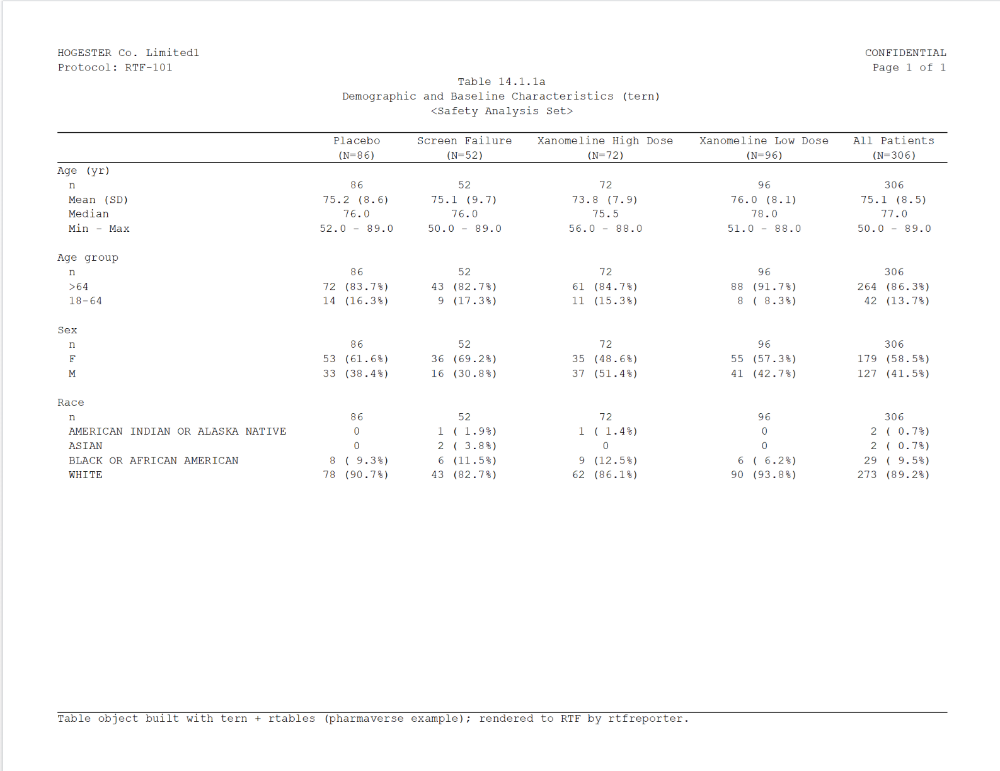
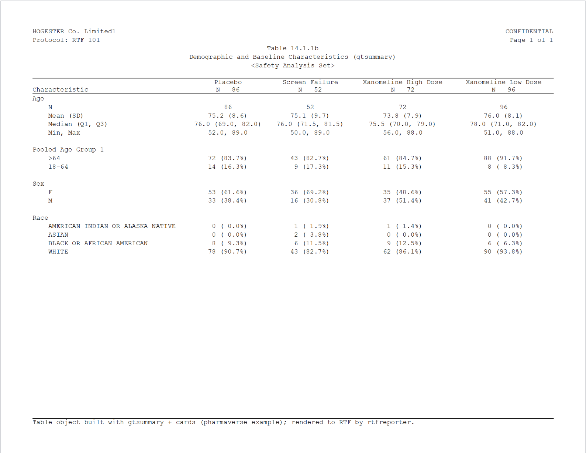
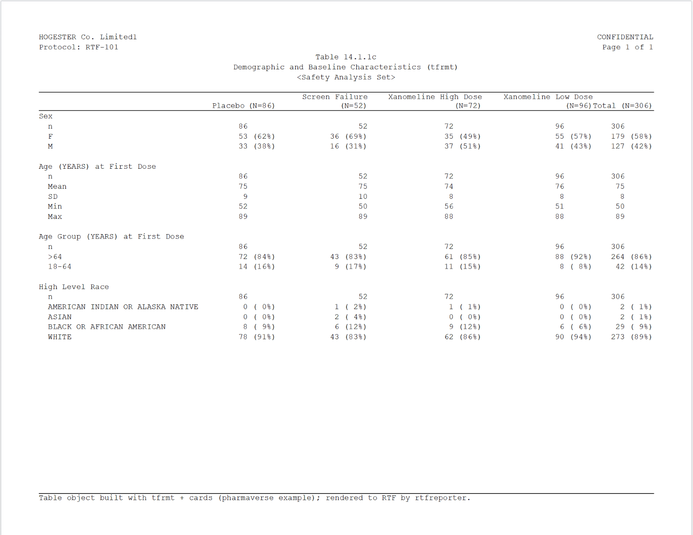
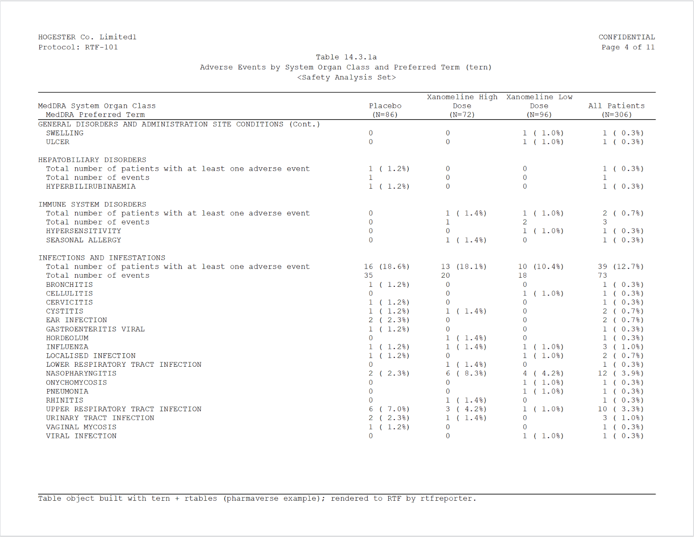
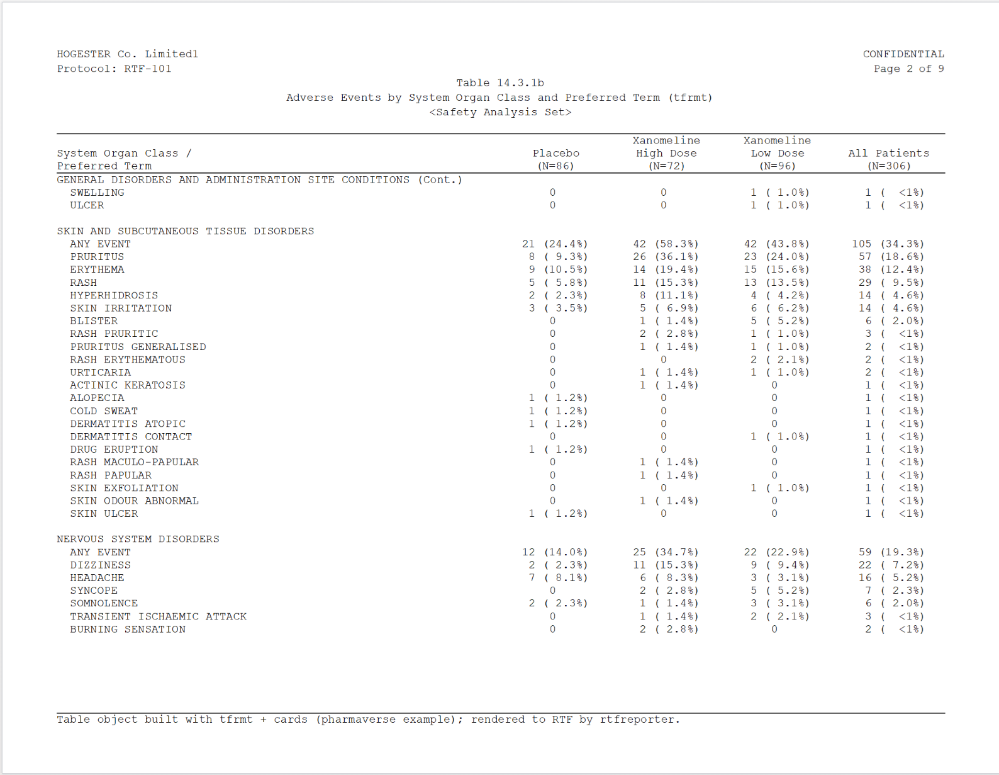
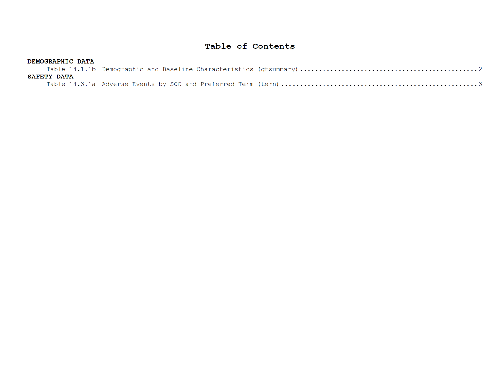

# From Pharmaverse Example tables to RTF reports

### The last mile for Pharmaverse Example tables

The [pharmaverse](https://pharmaverse.org) already produces beautiful
clinical tables – [tern](https://insightsengineering.github.io/tern/) /
[rtables](https://insightsengineering.github.io/rtables/),
[gtsummary](https://www.danieldsjoberg.com/gtsummary/) and
[tfrmt](https://gsk-biostatistics.github.io/tfrmt/) compute the
statistics and format the numbers, and the official [**Pharmaverse
Examples**](https://pharmaverse.github.io/examples/) show exactly how.
Where they stop is the **last mile**: turning that finished table
*object* into the paginated, header-bearing **RTF** page a regulatory
deliverable actually ships. That last little step is the gap rtfreporter
fills – with full respect for everything the pharmaverse already does,
and without reinventing any of it.

So this article picks up right where a **Pharmaverse Example** leaves
off. It takes the table objects built – *verbatim* – by the
[demographic](https://pharmaverse.github.io/examples/tlg/demographic.html)
and [adverse
events](https://pharmaverse.github.io/examples/tlg/adverse_events.html)
examples and adds only the final RTF step, with
[`as_rtftables()`](https://ichirio.github.io/rtfreporter/reference/as_rtftables.md) +
[`rtf_tables()`](https://ichirio.github.io/rtfreporter/reference/rtf_tables.md) +
[`generate_rtfreport()`](https://ichirio.github.io/rtfreporter/reference/generate_rtfreport.md).
The point is that **whichever pharmaverse package built your table,
rtfreporter can read its object** and carry it that last mile.

> All credit for the tables below belongs to the Pharmaverse Examples
> and their authors; rtfreporter only adds the last-mile RTF rendering.

**The rendered `.rtf` files produced by this article are committed to
the repository so you can open them yourself:
[`inst/rtf-examples/`](https://github.com/ichirio/rtfreporter/tree/main/inst/rtf-examples).**
The file names mark which pharmaverse example table each one came from
(e.g. `pharmaverse-adverse-events-tfrmt.rtf`).

## Rendering the Pharmaverse Example tables

Each table below is shown in four steps: the **Pharmaverse Example**
code that builds the table object (folded – expand it to copy), the
table object as the example prints it, the **rtfreporter** code that
carries it the last mile to RTF, and a snapshot of the resulting `.rtf`.

``` r

library(rtfreporter)
```

Two small helpers build the clinical running header and footer used by
every table below (the defaults – landscape Letter, one blank line under
the header – need no setup; see *Using rtfreporter* for the details):

``` r

make_header <- function(table_no, title, subtitle = "Safety Analysis Set") {
  rtf_header(rows = list(
    c(l = "HOGESTER Co. Limited", r = "CONFIDENTIAL"),
    c(l = "Protocol: RTF-101",     r = "Page {PAGE} of {TOTAL_PAGES}"),
    c(c = paste0("Table ", table_no)), c(c = title),
    c(c = paste0("<", subtitle, ">"))))
}
make_footer <- function(built_with) rtf_footer(c(l = paste0(
  "Table object built with ", built_with,
  " (Pharmaverse Example); rendered to RTF by rtfreporter.")))
```

### Demographics – three pharmaverse packages

The Pharmaverse *demographic* example builds the same table three
different ways – a tern `TableTree`, a gtsummary `gt_tbl` and a tfrmt
`gt_tbl`.
[`as_rtftables()`](https://ichirio.github.io/rtfreporter/reference/as_rtftables.md)
reads all three and the RTF comes out the same clinical shape.

The data preparation is shared – verbatim from the pharmaverse example:
screen failures are dropped and `SEX` / `AGEGR1` are recoded and
labelled.

``` r

library(dplyr)
adsl <- pharmaverseadam::adsl |>
  filter(!ACTARM %in% "Screen Failure") |>
  mutate(
    SEX = case_match(SEX, "M" ~ "MALE", "F" ~ "FEMALE"),
    AGEGR1 = case_when(
      between(AGE, 18, 40) ~ "18-40",
      between(AGE, 41, 64) ~ "41-64",
      AGE > 64            ~ ">=65") |>
      factor(levels = c("18-40", "41-64", ">=65"))) |>
  labelled::set_variable_labels(
    AGE = "Age (yr)", AGEGR1 = "Age group", SEX = "Sex", RACE = "Race")
```

#### tern + rtables (a `TableTree`)

Pharmaverse Example code (expand to copy)

``` r

library(tern)
adsl2 <- adsl |> df_explicit_na()
vars <- c("AGE", "AGEGR1", "SEX", "RACE")
var_labels <- c("Age (yr)", "Age group", "Sex", "Race")
lyt <- basic_table(show_colcounts = TRUE) |>
  split_cols_by(var = "ACTARM") |>
  add_overall_col("All Patients") |>
  analyze_vars(vars = vars, var_labels = var_labels)
dm_tern <- build_table(lyt, adsl2)
```

    #>                                        Placebo     Xanomeline High Dose   Xanomeline Low Dose   All Patients
    #>                                        (N=86)             (N=72)                (N=96)            (N=254)   
    #> ————————————————————————————————————————————————————————————————————————————————————————————————————————————
    #> Age (yr)                                                                                                    
    #>   n                                      86                 72                    96                254     
    #>   Mean (SD)                          75.2 (8.6)         73.8 (7.9)            76.0 (8.1)         75.1 (8.2) 
    #>   Median                                76.0               75.5                  78.0               77.0    
    #>   Min - Max                          52.0 - 89.0       56.0 - 88.0            51.0 - 88.0       51.0 - 89.0 
    #> Age group                                                                                                   
    #>   n                                      86                 72                    96                254     
    #>   18-40                                   0                 0                      0                 0      
    #>   41-64                              14 (16.3%)         11 (15.3%)             8 (8.3%)           33 (13%)  
    #>   >=65                               72 (83.7%)         61 (84.7%)            88 (91.7%)         221 (87%)  
    #> Sex                                                                                                         
    #>   n                                      86                 72                    96                254     
    #>   FEMALE                             53 (61.6%)         35 (48.6%)            55 (57.3%)        143 (56.3%) 
    #>   MALE                               33 (38.4%)         37 (51.4%)            41 (42.7%)        111 (43.7%) 
    #> Race                                                                                                        
    #>   n                                      86                 72                    96                254     
    #>   AMERICAN INDIAN OR ALASKA NATIVE        0              1 (1.4%)                  0              1 (0.4%)  
    #>   BLACK OR AFRICAN AMERICAN           8 (9.3%)          9 (12.5%)              6 (6.2%)          23 (9.1%)  
    #>   WHITE                              78 (90.7%)         62 (86.1%)            90 (93.8%)        230 (90.6%)

rtfreporter reads the `TableTree` with
[`as_rtftables()`](https://ichirio.github.io/rtfreporter/reference/as_rtftables.md)
(sizing the columns to their content with `auto_width`), wraps it in the
clinical header/footer, and writes the `.rtf`:

``` r

out_dm_tern <- tempfile(fileext = ".rtf")
rtf_document() |>
  rtf_section(page = 1, secinfo = list(
    header = make_header("14.1.1a", "Demographic and Baseline Characteristics (tern)"),
    footer = make_footer("tern + rtables"))) |>
  rtf_tables(as_rtftables(dm_tern, blank_rows = "between_groups",
                          auto_width = TRUE, cell_format = fmt_count_paren)) |>
  generate_rtfreport(out_dm_tern, overwrite = TRUE)
```



#### gtsummary + cards (a `gt_tbl`)

Pharmaverse Example code (expand to copy)

``` r

library(gtsummary); library(cards)
theme_gtsummary_compact()
ard <- ard_stack(
  adsl,
  ard_continuous(variables = AGE),
  ard_categorical(variables = c(AGEGR1, SEX, RACE)),
  .by = ACTARM, .attributes = TRUE)
dm_gts <- tbl_ard_summary(
  cards = ard, by = ACTARM,
  include = c(AGE, AGEGR1, SEX, RACE),
  type = AGE ~ "continuous2",
  statistic = AGE ~ c("{N}", "{mean} ({sd})",
                      "{median} ({p25}, {p75})", "{min}, {max}")) |>
  bold_labels() |>
  modify_header(all_stat_cols() ~ "**{level}**  \nN = {n}") |>
  modify_footnote(everything() ~ NA)
```

[TABLE]

The gtsummary object is a `gt_tbl`; rtfreporter reads it exactly the
same way – nothing about the call changes:

``` r

out_dm_gts <- tempfile(fileext = ".rtf")
rtf_document() |>
  rtf_section(page = 1, secinfo = list(
    header = make_header("14.1.1b", "Demographic and Baseline Characteristics (gtsummary)"),
    footer = make_footer("gtsummary + cards"))) |>
  rtf_tables(as_rtftables(dm_gts, blank_rows = "between_groups",
                          auto_width = TRUE, cell_format = fmt_count_paren)) |>
  generate_rtfreport(out_dm_gts, overwrite = TRUE)
```



#### tfrmt + cards (a `gt_tbl`)

Pharmaverse Example code (expand to copy)

``` r

library(tfrmt); library(cards); library(forcats)
ard <- ard_stack(
  adsl,
  ard_continuous(
    variables = AGE,
    statistic = ~ continuous_summary_fns(c("N", "mean", "sd", "min", "max"))),
  ard_categorical(variables = c(AGEGR1, SEX, RACE)),
  .by = ACTARM, .overall = TRUE, .total_n = TRUE)
ard_tbl <- ard |>
  shuffle_card(fill_overall = "Total") |>
  prep_big_n(vars = "ACTARM") |>
  prep_combine_vars(vars = c("AGE", "AGEGR1", "SEX", "RACE")) |>
  prep_label() |>
  group_by(ACTARM, stat_variable) |>
  mutate(across(c(variable_level, label), ~ ifelse(stat_name == "N", "n", .x))) |>
  ungroup() |> unique() |>
  mutate(
    ord1 = fct_inorder(stat_variable) |> fct_relevel("SEX", after = 0) |> as.numeric(),
    ord2 = ifelse(label == "n", 1, 2)) |>
  mutate(stat_variable = case_when(
    stat_variable == "AGE"    ~ "Age (YEARS) at First Dose",
    stat_variable == "AGEGR1" ~ "Age Group (YEARS) at First Dose",
    stat_variable == "SEX"    ~ "Sex",
    stat_variable == "RACE"   ~ "High Level Race", .default = stat_variable)) |>
  select(ACTARM, stat_variable, label, stat_name, stat, ord1, ord2) |> unique()
dm_tfrmt <- tfrmt(
  group = stat_variable, label = label, param = stat_name,
  value = stat, column = ACTARM, sorting_cols = c(ord1, ord2),
  body_plan = body_plan(
    frmt_structure(".default", ".default", frmt("xxx")),
    frmt_structure(".default", ".default",
      frmt_combine("{n} ({p}%)", n = frmt("xxx"),
                   p = frmt("xx", transform = ~ . * 100)))),
  big_n = big_n_structure(param_val = "bigN", n_frmt = frmt(" (N=xx)")),
  col_plan = col_plan(-starts_with("ord")),
  col_style_plan = col_style_plan(col_style_structure(
    col = c("Placebo", "Xanomeline High Dose", "Xanomeline Low Dose", "Total"),
    align = "left")),
  row_grp_plan = row_grp_plan(row_grp_structure(
    ".default", element_block(post_space = " ")))) |>
  print_to_gt(ard_tbl)
```

[TABLE]

tfrmt also renders to a `gt_tbl`, so once more the rtfreporter call is
the same (this example formats its statistics as integers; rtfreporter
reproduces whatever the object contains):

``` r

out_dm_tfrmt <- tempfile(fileext = ".rtf")
rtf_document() |>
  rtf_section(page = 1, secinfo = list(
    header = make_header("14.1.1c", "Demographic and Baseline Characteristics (tfrmt)"),
    footer = make_footer("tfrmt + cards"))) |>
  rtf_tables(as_rtftables(dm_tfrmt, auto_width = TRUE,
                          cell_format = fmt_count_paren)) |>
  generate_rtfreport(out_dm_tfrmt, overwrite = TRUE)
```



### Adverse events – paginated across many pages

The Pharmaverse *adverse events* example is a genuinely large table – 23
system-organ classes and 242 preferred terms – so it spans **many**
pages. This is where the last mile is most visible:
[`as_rtftables()`](https://ichirio.github.io/rtfreporter/reference/as_rtftables.md)
paginates the object and repeats the column and running headers on every
page. The example builds it two ways, which also shows the **two
pagination strategies**:

- **`split = "group_safe"`** (tern) never breaks an SOC across a page
  boundary.
- **`split = "group_force"`** (tfrmt) fills each page to `max_rows` and
  repeats the SOC label with `" (Cont.)"` at the top of the next page
  when a group is split.

#### tern + rtables (a `TableTree`)

Pharmaverse Example code (expand to copy)

``` r

library(tern); library(dplyr)
adsl_ae <- pharmaverseadam::adsl |> df_explicit_na()
adae_ae <- pharmaverseadam::adae |> df_explicit_na() |>
  var_relabel(AEBODSYS = "MedDRA System Organ Class",
              AEDECOD  = "MedDRA Preferred Term") |>
  filter(SAFFL == "Y")
split_fun <- drop_split_levels
ae_lyt <- basic_table(show_colcounts = TRUE) |>
  split_cols_by(var = "ACTARM") |>
  add_overall_col(label = "All Patients") |>
  analyze_num_patients(
    vars = "USUBJID", .stats = c("unique", "nonunique"),
    .labels = c(
      unique    = "Total number of patients with at least one adverse event",
      nonunique = "Overall total number of events")) |>
  split_rows_by("AEBODSYS", child_labels = "visible", nested = FALSE,
                split_fun = split_fun, label_pos = "topleft",
                split_label = obj_label(adae_ae$AEBODSYS)) |>
  summarize_num_patients(
    var = "USUBJID", .stats = c("unique", "nonunique"),
    .labels = c(
      unique    = "Total number of patients with at least one adverse event",
      nonunique = "Total number of events")) |>
  count_occurrences(vars = "AEDECOD", .indent_mods = -1L) |>
  append_varlabels(adae_ae, "AEDECOD", indent = 1L)
ae_tern <- build_table(ae_lyt, df = adae_ae, alt_counts_df = adsl_ae)
```

The object is too large to print, so we go straight to the RTF. The
rtfreporter call adds the deliverable touches: `split = "group_safe"`
pagination, a wide first column so the long labels stay on one line,
centred data columns, and `fmt_count_paren` to line the counts and
percentages up:

``` r

# adverse-events column alignment: row label left, the data columns centred
ae_col_spec <- c(list(list(col = 1L, align = "left")),
                 lapply(2:5, function(j) list(col = j, align = "center")))
ae_tern_pages <- as_rtftables(ae_tern, split = "group_safe", max_rows = 36,
                              blank_rows = "between_groups",
                              cell_format = fmt_count_paren,
                              col_rel_width = c(0.50, 0.125, 0.125, 0.125, 0.125),
                              col_spec = ae_col_spec, row_height_twips = 200)
out_ae_tern <- tempfile(fileext = ".rtf")
rtf_document() |>
  rtf_section(page = 1, secinfo = list(
    header = make_header("14.3.1a", "Adverse Events by System Organ Class and Preferred Term (tern)"),
    footer = make_footer("tern + rtables"))) |>
  rtf_tables(ae_tern_pages) |>
  generate_rtfreport(out_ae_tern, overwrite = TRUE)
```



#### tfrmt + cards (a `gt_tbl`)

Pharmaverse Example code (expand to copy)

``` r

library(tfrmt); library(cards); library(dplyr)
# pharmaverse cards + tfrmt example: safety population, treatment-emergent events
adsl_ae_tf <- pharmaverseadam::adsl |> filter(SAFFL == "Y")
adae_ae_tf <- pharmaverseadam::adae |> filter(SAFFL == "Y" & TRTEMFL == "Y")
ae_ard <- ard_stack_hierarchical(
  data = adae_ae_tf, by = ACTARM, variables = c(AEBODSYS, AEDECOD),
  statistic = ~ c("n", "p"), denominator = adsl_ae_tf, id = USUBJID,
  over_variables = TRUE, overall = TRUE)
ae_tot <- ard_stack_hierarchical(
  data = mutate(adae_ae_tf, ACTARM = "All Patients"), by = ACTARM,
  variables = c(AEBODSYS, AEDECOD),
  denominator = mutate(adsl_ae_tf, ACTARM = "All Patients"),
  statistic = ~ c("n", "p"), id = USUBJID,
  over_variables = TRUE, overall = TRUE) |>
  filter(group2 == "ACTARM" | variable == "ACTARM")
ae_card <- bind_ard(ae_ard, ae_tot) |>
  shuffle_card(fill_hierarchical_overall = "ANY EVENT") |>
  prep_big_n(vars = "ACTARM") |>
  prep_hierarchical_fill(vars = c("AEBODSYS", "AEDECOD"), fill = "ANY EVENT") |>
  mutate(ACTARM = ifelse(ACTARM == "Overall ACTARM", "All Patients", ACTARM))
ord_soc <- ae_card |>
  filter(ACTARM == "All Patients", stat_name == "n", AEDECOD == "ANY EVENT") |>
  arrange(desc(stat)) |> mutate(ord1 = row_number()) |> select(AEBODSYS, ord1)
ord_pt <- ae_card |>
  filter(ACTARM == "All Patients", stat_name == "n") |>
  group_by(AEBODSYS) |> arrange(desc(stat)) |>
  mutate(ord2 = row_number()) |> select(AEBODSYS, AEDECOD, ord2)
ae_card <- ae_card |>
  full_join(ord_soc, by = "AEBODSYS") |>
  full_join(ord_pt, by = c("AEBODSYS", "AEDECOD")) |>
  select(AEBODSYS, AEDECOD, ord1, ord2, stat, stat_name, ACTARM)
ae_tfrmt <- tfrmt_n_pct(
  n = "n", pct = "p",
  pct_frmt_when = frmt_when(
    "==1" ~ frmt("(100%)"), ">=0.995" ~ frmt("(>99%)"), "==0" ~ frmt(""),
    "<=0.01" ~ frmt("(<1%)"), "TRUE" ~ frmt("(xx.x%)", transform = ~ . * 100))) |>
  tfrmt(
    group = AEBODSYS, label = AEDECOD, param = stat_name, value = stat,
    column = ACTARM, sorting_cols = c(ord1, ord2),
    col_plan = col_plan("System Organ Class / Preferred Term" = AEBODSYS,
                        Placebo, `Xanomeline High Dose`, `Xanomeline Low Dose`,
                        -ord1, -ord2),
    row_grp_plan = row_grp_plan(row_grp_structure(
      group_val = ".default", element_block(post_space = " "))),
    big_n = big_n_structure(param_val = "bigN", n_frmt = frmt(" (N=xx)"))) |>
  print_to_gt(ae_card)
```

This one renders to a `gt_tbl`, so we use `split = "group_force"`
pagination, two/three-line column headers (so the data columns can be
narrow), and `fmt_count_paren_bare` (which also lines up the bare `0`
counts):

``` r

ae_hdr <- c("System Organ Class /\nPreferred Term", "Placebo\n(N=86)",
            "Xanomeline\nHigh Dose\n(N=72)",
            "Xanomeline\nLow Dose\n(N=96)", "All Patients\n(N=254)")
ae_tfrmt_pages <- as_rtftables(ae_tfrmt, split = "group_force", max_rows = 36,
                               col_header = ae_hdr,
                               col_rel_width = c(0.50, 0.125, 0.125, 0.125, 0.125),
                               col_spec = ae_col_spec, cell_format = fmt_count_paren_bare,
                               row_height_twips = 200)
out_ae_tfrmt <- tempfile(fileext = ".rtf")
rtf_document() |>
  rtf_section(page = 1, secinfo = list(
    header = make_header("14.3.1b", "Adverse Events by System Organ Class and Preferred Term (tfrmt)"),
    footer = make_footer("tfrmt + cards"))) |>
  rtf_tables(ae_tfrmt_pages) |>
  generate_rtfreport(out_ae_tfrmt, overwrite = TRUE)
```



### Assembling a deliverable – with a Table of Contents

A real submission bundles many TLGs into one file. Render each table to
its own `.rtf` (the recipes above leave the paths in `out_dm_gts` and
`out_ae_tern`), then concatenate them with
[`assemble_rtf()`](https://ichirio.github.io/rtfreporter/reference/assemble_rtf.md).
Passing `toc =` a list of
[`toc_heading()`](https://ichirio.github.io/rtfreporter/reference/toc_heading.md)
/
[`toc_entry()`](https://ichirio.github.io/rtfreporter/reference/toc_entry.md)
adds a clickable **Table of Contents** at the front, and
`toc_page_numbering = "decimal"` numbers its pages.

Each table keeps its own baked-in `Page X of Y` footer: the recipes use
the static `{PAGE}` / `{TOTAL_PAGES}` tokens (resolved to real numbers
at render time, so every viewer shows them) rather than the dynamic
`{AUTO_PAGE}` / `{AUTO_TOTAL_PAGES}` fields.

Show the code (assemble + Table of Contents)

``` r

library(rtfreporter)
bundle <- tempfile(fileext = ".rtf")
assemble_rtf(
  c(out_dm_gts, out_ae_tern), bundle, overwrite = TRUE,
  toc = list(
    toc_heading("DEMOGRAPHIC DATA", level = 1),
    toc_entry("Table 14.1.1b  Demographic and Baseline Characteristics (gtsummary)",
              file = out_dm_gts, level = 2),
    toc_heading("SAFETY DATA", level = 1),
    toc_entry("Table 14.3.1a  Adverse Events by SOC and Preferred Term (tern)",
              file = out_ae_tern, level = 2)),
  toc_title = "Table of Contents",
  toc_page_numbering = "decimal")
```

The generated Table of Contents:



and a body page from the assembled deliverable (note the per-table
`Page X of Y` footer):


For a whole folder of `.rtf` files there is a one-call shortcut that
reads each file’s header, builds the Table of Contents and assembles the
deliverable – optionally saving the editable “assembly spec” (an `.xlsx`
/ `.csv` you can tweak and re-run):

``` r

assemble_folder("path/to/rtf", "deliverable.rtf", spec_file = "spec.xlsx")
```

See
[`assemble_folder()`](https://ichirio.github.io/rtfreporter/reference/assemble_folder.md),
[`assemble_spec()`](https://ichirio.github.io/rtfreporter/reference/assemble_spec.md)
and
[`assemble_from_spec()`](https://ichirio.github.io/rtfreporter/reference/assemble_from_spec.md).

## Using rtfreporter

The examples above kept the rtfreporter-specific code to a minimum. This
section collects the pieces you can tune.

### Headers and footers

[`rtf_header()`](https://ichirio.github.io/rtfreporter/reference/rtf_header.md)
/
[`rtf_footer()`](https://ichirio.github.io/rtfreporter/reference/rtf_header.md)
take rows of left / centre / right cells (`l` / `c` / `r`). For “Page X
of Y” there are two flavours of token:

- `{AUTO_PAGE}` / `{AUTO_TOTAL_PAGES}` – *dynamic* RTF fields,
  recomputed by the viewer (and across
  [`assemble_rtf()`](https://ichirio.github.io/rtfreporter/reference/assemble_rtf.md)),
  so they always show the live page numbers.
- `{PAGE}` / `{TOTAL_PAGES}` – *static* numbers baked in at render time,
  so each table carries its own real `Page X of Y` text that every
  viewer shows identically and
  [`assemble_rtf()`](https://ichirio.github.io/rtfreporter/reference/assemble_rtf.md)
  leaves untouched. The recipes above use these.

### Pagination

[`as_rtftables()`](https://ichirio.github.io/rtfreporter/reference/as_rtftables.md)
turns one table object into a list of one-page `rtftable`s. The `split`
argument controls how:

- `"group_safe"` – never breaks a row group; an SOC that would overflow
  moves whole to the next page.
- `"group_force"` – cuts strictly at `max_rows`, inserting a `(Cont.)`
  row so the reader knows the group continues.
- `"by_value"` – one group per page.
- `"rows"` – split at explicit row positions (`split_rows`).
- `"none"` – a single page.

`blank_rows = "between_groups"` inserts a blank line between row groups,
and `align_count_pct = TRUE` re-pads `n (xx.x%)` cells so the
percentages line up in a monospaced renderer.

### Cell formatting

Different table packages write count/percent cells in different
notations, so rtfreporter does not hard-code one. Instead,
`as_rtftables(cell_format = )` takes a **cell-format function** that is
applied column-by-column to the body just before pagination. rtfreporter
ships a few:

- [`fmt_count_paren()`](https://ichirio.github.io/rtfreporter/reference/fmt_count_paren.md)
  – the workhorse, used by **both** adverse-events tables. It scans the
  whole column, then right-justifies the integer count and
  right-justifies the number *inside* the parentheses, so a column
  mixing `"4 ( 4.7%)"`, `"10 (11.6%)"`, `"3 (<1%)"`, `"70 (100%)"` and a
  lone `"0"` all share one width and line up on both the count digit and
  the percentage. (It also copes with the 4-digit event totals in the
  tern table, which the fixed-width helper below cannot.)
- `align_count_pct = TRUE` /
  [`realign_count_pct()`](https://ichirio.github.io/rtfreporter/reference/realign_count_pct.md)
  – the older fixed-width helper for plain `"n (xx.x%)"` cells; kept for
  back-compatibility.
- [`fmt_right_align()`](https://ichirio.github.io/rtfreporter/reference/fmt_right_align.md)
  – the simplest one: right-justify a column to a common width.

A cell-format function follows a small **contract**:

> It takes one column – a character vector – and returns a character
> vector of the **same length**. Cells it should not touch are returned
> unchanged, and any padding uses the non-breaking space (U+00A0,
> written `"\u00a0"`) so Word does not collapse it.

When none of the built-ins matches your data, write your own.
[`fmt_right_align()`](https://ichirio.github.io/rtfreporter/reference/fmt_right_align.md)
is the template – here is the whole of it, which you can copy and adapt:

``` r

my_right_align <- function(x, nbsp = "\u00a0") {
  x  <- as.character(x)
  nz <- nzchar(trimws(x))                       # the non-empty cells
  w  <- max(nchar(x[nz]), 0L)                   # widest cell in the column
  x[nz] <- formatC(x[nz], width = w, flag = "") # right-justify to that width
  gsub(" ", nbsp, x, fixed = TRUE)              # spaces -> non-breaking spaces
}
my_right_align(c("12 (3.6%)", "0", "1 (0.5%)"))
#> [1] "12 (3.6%)" "        0" " 1 (0.5%)"
```

Pass it with `cell_format = my_right_align` (a single function applies
to every data column; a list applies one function per column).

### What carries across, by source

What does and does not survive the conversion (column headers, spanning,
alignment, titles, footnotes) depends on the source object and is
documented in the *What is carried, by source* table in
[`?as_rtftables`](https://ichirio.github.io/rtfreporter/reference/as_rtftables.md).

### Notes

- The output is `.rtf`; open it in Word / LibreOffice (or batch-convert
  to PDF).
- The pharmaverse example tables are reproduced here unchanged; only the
  final RTF-rendering step is rtfreporter’s.

### Where next

- [Worked example:
  demographics](https://ichirio.github.io/rtfreporter/articles/example-demog.md)
  — one table, start to finish
- [Worked example:
  laboratory](https://ichirio.github.io/rtfreporter/articles/example-lab.md)
  — a shift table, start to finish

The four recipes (`?rtfreporter-recipes`) are the same ground covered as
runnable help-page examples: demographics, adverse events, PK and
laboratory, each data-in to RTF-out.
